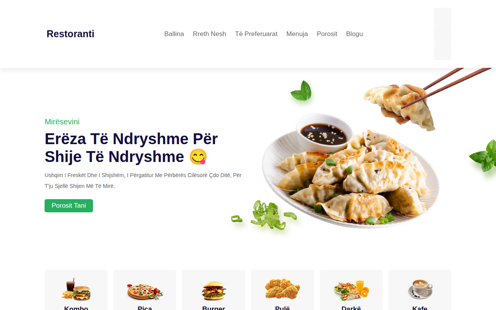

# Restaurant-Site 🍽️

Faqe restoranti me menu, galeri dhe formë porosie — dizajn elegant dhe plotësisht responsive, e përshtatur në shqip.

## Demo live

👉 https://erionnezha.github.io/Restaurant-Site/

## Përshkrimi

Faqe moderne restoranti me:
- Navigim sticky me shportë, kërkim dhe hyrje
- Seksion balline me efekt parallax
- Kategori ushqimesh
- Rreth nesh me shërbimet
- Pjata të preferuara me çmime dhe vlerësime
- Banner ofertash
- Menu të plotë
- Formë porosie me hartë
- Blog dhe footer me orarin e hapjes

## Hapja lokalisht

1. Shkarko ose klono këtë repo
2. Hap `index.html` në shfletues

Kaq — nuk kërkon server apo build.

## Teknologjitë

- HTML5
- CSS3
- JavaScript (vanilla)
- Font Awesome 5

## Kontakti

- 📞 +355 6XX XXX XXX
- ✉️ shembull@example.com
- 📍 Tiranë, Shqipëri

## Licenca

MIT — shih skedarin [LICENSE](LICENSE).

---

# Restaurant-Site (English)

Restaurant website with menu, gallery and order form — elegant, fully responsive design, localized in Albanian.

## Live demo

👉 https://erionnezha.github.io/Restaurant-Site/

## Description

Modern restaurant page featuring: sticky navigation with cart, search and login; hero section with parallax effect; food categories; about section; popular dishes with prices and ratings; offer banners; full menu; order form with map; blog and footer with opening hours.

## Run locally

1. Download or clone this repo
2. Open `index.html` in a browser

That's it — no server or build needed.

## Technologies

- HTML5
- CSS3
- Vanilla JavaScript
- Font Awesome 5

## Contact

- 📞 +355 6XX XXX XXX
- ✉️ shembull@example.com
- 📍 Tirana, Albania

## License

MIT — see [LICENSE](LICENSE).
